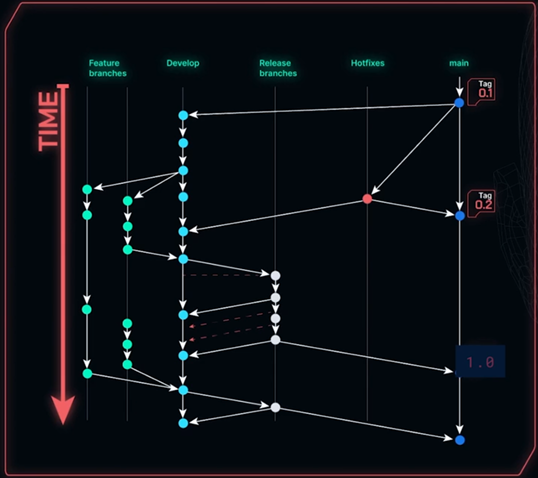

# git-concepts
[EXCELENTE guia para o git](https://www.alura.com.br/artigos/o-que-e-git-github), completo e detalhado, cheio de exemplos e links de referência, pode ser usado como um material de pesquisa "antes da internet".

[Visualizing-git](https://git-school.github.io/visualizing-git/)

Conceitos e práticas no uso do git.\
Repositórios existem locais e remotos.\
- HEAD - branch atual `cat .git/HEAD`\
- HEAD - apelido/ponteiro para o último commit\
- staging area (stage) - local onde os commits são feitos (palco, pronto pra entrar), após o git add.\
- Working Tree - tudo que modifiquei e não está no stage.

## Fluxo de trabalho
1. git status
1. git add / commit / push
1. git pull
1. git status / [diff](https://git-scm.com/docs/git-diff/pt_BR)

## Identidade
ssh melhor que https

Autor dos commits:\
git config --global user.email "email@email.com"\
git config --global user.name "nome completo"

## Colaborar
1.  **Issues**: novos recursos ou correções.
1. **Fork** cópia do repositório para a minha conta.
1. **Pull Request** para integrar ao repositório.
1. **Github Gist** para compartilhar trechos de códigos e não o código inteiro com novos repositórios.

## Ignorar
`.gitignore`\
Padrão de nomes para ignorar.

Sugestão de ferramental para auxílio na criação de gitignore:
- [gitignore.io](https://gitignore.io/)

## Comandos
- [Remote](remote)
- [Commit](commit)
- [Log](log)
- [Diff](diff)
- [Branch](branch)
- [Stash](stash)
- [Restore](restore)
- [Tag](tag)

### Show
`git show <id_do_commit>`
Mostra o que foi alterado em um commit.

### Push
Envia as mudanças para o repositório\
`git push origin main`\
Faz o upload dos arquivos.\
origin é o apelido do repositório remoto (`git remote`)

`git push origin funcionalidade`
Upload das alterações para o branch remoto _funcionalidade_

### Pull
Baixar os commits do repositório remoto para o repositório local.\
`git pull origin main`\
origin - qual é o repositório remoto que vou baixar (origin é o apelido)\
main - branch main para onde vai trazer os commits

### Conflito
Havendo **conflito** resolvo ele manualmente no código ou uso o [merge editor](https://learn.microsoft.com/pt-br/visualstudio/version-control/git-resolve-conflicts?view=vs-2022) e faço um commit apenas da resolução do conflito.

["The base"](https://www.youtube.com/watch?v=HosPml1qkrg&ab_channel=VisualStudioCode) - referência de resolução de conflito comparando ambos com o baseline.

### Revert
Preciso reverter uma modificação aplicada em algum commit.\
Faço o `git log` para obter o ID do commit.\
Reverto usando `git revert <ID>`.\
Verifico o arquivo gerado que será o novo commit relacionado a este revert e em seguida fecho ele.\
`git add / push`.

### Reset
Apaga um commit.\
`git reset --hard <ID_commit_anterior>`\
O ID é do commit que estará vigente no código atual, então desfaz tudo até o commit informado. Não informo o commit para apagar, mas informo o commit que quero que seja o estado do código atual (HEAD).\
**NÃO apagar** se já tiver feito o push para evitar confusão no histórico.
[Documentação](https://git-scm.com/docs/git-reset/pt_BR).

### Merge
`git switch main` seguido de `git merge funcionalidade`
Traz as alterações realizadas no branch funcionalidade para o main.
1. _Fast-forward_: o merge é feito sem um commit, não houve alterações no main entre a criação do branch funcionalidade e seu merge com o main.\
Se quiser forçar o commit use `git merge --no-ff {nome_da_branch}`
2. _Merge commit_: o merge é feito e já abre o editor com uma mensagem de commit sugerida, porque neste caso houveram alterações tanto no branch funcionalidade quanto no main, logo, elas precisaram se mesclar.

## Releases
Uma release (em português: lançamento) refere-se a uma versão específica e identificável de um software que é disponibilizada para os usuários finais.

Quero disponibilizar o release do projeto mas, além do projeto em si, vai ter por exemplo um CHANGELOG, etc.

Pode ser feita pelo Github Actions automatizando (por exemplo).

A release será criada a partir da tag.

Insere as release notes (changelog, diff, etc).

Se tivesse um projeto compilado poderia ser incluído para download.

Já é disponibilizado no Github Releases os arquivos .zip e .targz. Esses arquivos são o projeto em si, comprimidos em dois formatos diferentes (Zip e GZip). Dessa forma, pessoas que não utilizem git também podem ter acesso ao código fonte dessa release.

## Patches
Quando quero um backup por exemplo ou disponibilizar o que eu tenho para outra pessoa, mas sem ter que fazer um commit ou gerar um branch, por qualquer motivo, gero um patch.

`git add .`

`git diff --staged > wip.patch`
Gera o diff em um arquivo.

`git apply wip.patch`
Aplica o patch localmente.

## Git Flow x Trunk Based

### Git Flow
Um modelo estruturado com ramos bem definidos: master, develop, feature, release, hotfix.

Prós:
- Ótimo para equipes grandes.
- Facilita controle de versões e preparação de releases.
- Isola bem diferentes tipos de trabalho.

Ideal para:
- Projetos com versões bem definidas (ex: softwares on-premise).
- Equipes com estrutura formal e processo de release.

### Trunk Based Development (TBD)
Todo o time trabalha diretamente (ou quase diretamente) na branch principal (geralmente main ou trunk).
**CI/CD é essencial**.

Prós:
- Entregas contínuas e rápidas.
- Integração frequente evita conflitos grandes.
- Simplifica automação.

Contras:
- Exige alta disciplina e testes automatizados.
- Pode ser difícil gerenciar para equipes inexperientes.
- Sem feature flags, pode vazar código incompleto.

Ideal para:
- Startups, times ágeis, DevOps, CI/CD.
- Equipes experientes em testes e integração contínua.

### Git Básico / GitHub Flow
Modelo simples baseado em uma branch principal (main) e branches de feature.

Fluxo típico:
1. Cria-se uma branch por feature ou bugfix.
1. Pull request para main com revisão.
1. Merge e deploy.
