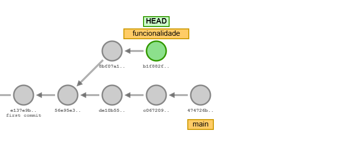
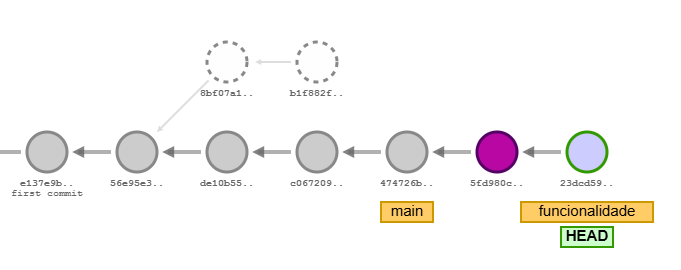

# Rebase
Ele cria uma linha de base contínua, considerando que o branch foi atualizado e o main também. Então ele "alinha" os commits tentando inserir todas as atualizações realizadas no main antes do primeiro commit no branch.

1. `git checkout -b main`
1. `git branch -d master`
1. `git commit`
1. `git branch funcionalidade`
1. `git commit`
1. `git commit`
1. `git commit`
1. `git checkout funcionalidade`
1. `git commit`
1. `git commit`
1. `git rebase main`

O merge junta os trabalhos de duas branches, podendo gerar um merge commit. Já o rebase aplica os commits de outra branch na branch atual.

O trabalho do rebase é equivalente ao que vimos na prática como fast forward do merge. Ao realizar o rebase, todos os commits da outra branch são adicionados antes do primeiro commit da nossa branch atual, reescrevendo a história. Isso faz com que novas alterações possam ser integradas à nossa branch e permite que quando formos realizar o merge, não seja necessário um merge commit, garantindo o fast forward.
